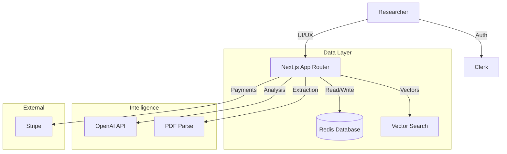

# instantTEA System Documentation

## 1. System Overview

**instantTEA** (Translational, Ephemeral Assemblages) is an open-source platform for critical policy and governance research. It bridges the gap between policy intent and algorithmic reality by translating complex socio-technical assemblages into provisional, situated snapshots.

### Core Philosophy
- **Translational**: Actively producing knowledge through inscription and enrollment (ANT).
- **Ephemeral**: Capturing fleeting moments of territorialization/deterritorialization (Assemblage Theory).
- **Critical**: Exposing power structures and hidden agencies.

---

## 2. Architecture

The application is built on a modern **Next.js 16** stack, optimized for performance, scalability, and security.

### Tech Stack
- **Framework**: Next.js 16 (App Router, Turbopack)
- **Language**: TypeScript
- **Styling**: Tailwind CSS, Shadcn UI, Lucid React
- **Data Persistence**: Redis (via `ioredis` / Upstash) + Local Storage Fallback
- **Auth**: Clerk (Middleware-protected routes)
- **AI/LLM**: OpenAI GPT-4o (via `openai` SDK)
- **Payments**: Stripe (Elements & Webhooks)
- **Visualization**: D3.js, React Force Graph

### Component Diagram


---

## 3. Key Components & Data Flow

### 3.1 Authentication & Authorization
- **Provider**: Clerk.
- **Middleware**: `src/middleware.ts` protects all `/api/*` and dashboard routes.
- **Demo Mode**: Read-only system state configured via `NEXT_PUBLIC_ENABLE_DEMO_MODE`.
- **RBAC**: Admin users defined via `ADMIN_USER_IDS` env var have privileged access (e.g., prompt editing).

### 3.2 Data Ingestion & Analysis (`/data`)
1.  **Ingestion**: Users upload PDFs or scrape URLs.
2.  **Extraction**: `src/lib/content-extractor.ts` parses raw text.
3.  **Analysis**: 
    - Text is sent to `/api/analyze`.
    - `src/lib/analysis-service.ts` coordinates LLM calls using specific theoretical lenses (e.g., Situated Teleology, Normative Attractors).
    - Results are cached in Redis (24h TTL) to minimize costs.

### 3.3 Ecosystem Mapping (`/ecosystem`)
- **Actors**: Identified entities (human/non-human) are stored as nodes.
- **Assemblage**: Relationships are mapped using force-directed graphs.
- **State**: Side panels (`Actors` left, `Analysis` right) are open by default for immediate context.

### 3.4 Payments & Credits System
- **Model**: Credit-based usage (1 analysis = 1 credit).
- **Storage**: Redis Atomic Counters (`INCR`, `DECR`, `Lua Scripts`).
- **Processing**: Stripe Checkout session → Webhook (`payment_intent.succeeded`) → Credit Top-up.
- **Security**: Webhook signatures verified to prevent spoofing.

### 3.5 Security Features
- **Strict Headers**: HSTS, X-Frame-Options, No-Sniff configured in `next.config.ts`.
- **Input Validation**: Manual checks in API routes; read-only guards in mutation endpoints.
- **Dependency Management**: Automated audits (`npm audit`) enforced.

---

## 4. Configuration

### Environment Variables (.env.local)

| Variable | Description | Required |
|----------|-------------|----------|
| `NEXT_PUBLIC_CLERK_PUBLISHABLE_KEY` | Clerk Auth Public Key | Yes |
| `CLERK_SECRET_KEY` | Clerk Auth Secret Key | Yes |
| `OPENAI_API_KEY` | OpenAI API Key for analysis | Yes |
| `REDIS_URL` | Connection string for Redis | Yes |
| `STRIPE_SECRET_KEY` | Stripe Secret for payments | Yes |
| `STRIPE_WEBHOOK_SECRET` | Signature verification secret | Yes |
| `NEXT_PUBLIC_ENABLE_DEMO_MODE` | Set `true` to enable read-only demo | No |
| `ADMIN_USER_IDS` | Comma-separated list of Admin user IDs | No |

---

## 5. Deployment

### Recommended: Vercel
1.  **Push to Git**: Ensure main branch is up to date.
2.  **Import Project**: Select repository in Vercel.
3.  **Env Vars**: Copy all production values to Vercel Settings.
4.  **Build Command**: `next build`.
5.  **Output Directory**: `.next`.

### Docker (Optional)
A `docker-compose.yml` is provided for local Redis orchestration.

---

## 6. Developer Workflows

### Running Locally
```bash
npm install
npm run dev
```

### Running Tests
```bash
# Security Audit
npm audit

# API Tests
npm run test:api
```

### Adding New Prompts
Prompts are managed in `src/lib/prompts/registry.ts`. Admins can override them via the `/settings/prompts` UI.

---

**Version**: 1.0.0
**License**: MIT
