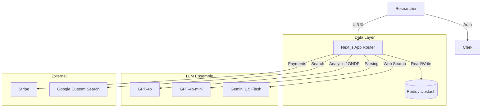

# Policy Prism — System Documentation

## 1. System Overview

**Policy Prism** is an open-source research platform for critical analysis of AI governance policy through the theoretical lenses of Actor-Network Theory (ANT) and Assemblage Theory. It transforms static policy documents into dynamic, multi-dimensional analytical artefacts — mapping actors, relationships, structural absences, and governance architectures across jurisdictions.

### Design Principles
- **Traceability**: Every analytical claim is grounded in verbatim textual evidence with provenance tracking.
- **Contestability**: Analyst override, disagreement logging, and positionality recording ensure interpretive claims remain open to challenge.
- **Productive Friction**: The system surfaces ambiguity, contradiction, and structural tension rather than resolving them prematurely.

---

## 2. Architecture

### Tech Stack
| Component | Technology |
|---|---|
| **Framework** | Next.js 16 (App Router, Turbopack) |
| **Language** | TypeScript |
| **Styling** | Tailwind CSS, Shadcn UI, Lucide React |
| **Data Persistence** | Redis (Upstash) with 86,400s TTL caching |
| **Authentication** | Clerk (middleware-protected routes, Google OAuth) |
| **LLM Ensemble** | GPT-4o (structured extraction, GNDP), GPT-4o-mini (parsing, lightweight passes), Gemini 1.5 Flash (web search) |
| **Payments** | Stripe (Elements & Webhooks) |
| **Visualisation** | D3.js, React Force Graph, Recharts |
| **Export** | DOCX generation with native image capture of React-rendered D3/Recharts diagrams |

### Component Diagram


---

## 3. Eight-Layer Analytical Architecture

The system implements an eight-layer analytical framework, each generating independent analytical strata:

| Layer | Analysis Mode | Output |
|---|---|---|
| 1. Relationship Extraction | ANT Tracing, Assemblage Extraction | Actors, associations, mediator classifications |
| 2. Ecosystem Mapping | Ecosystem Impact Analysis | Force-directed network graph with typed edges (Power, Logic, Ghost) |
| 3. Ghost Node Detection | GNDP v1.0 (4-pass pipeline) | Structurally absent actors with weighted scoring, evidence grading, counterfactual tests |
| 4. Ontology Generation | Concept Mapping + Comparison | Conceptual distance metrics across policy architectures |
| 5. Cultural Framing | Institutional Logics, Cultural Framing, Legitimacy | State-market-society configurations, dominant discursive frames |
| 6. Resistance Analysis | Resistance Detection + Discourse Analysis | Counter-conduct strategies, micro-resistance typologies |
| 7. Comparative Synthesis | Cross-document divergence mapping | Shared structural spines, unique components, axes of divergence |
| 8. Meta-Synthesis | Translational Legibility Framework (TLF), Controversy Mapping, Abstract Machine Extraction | Five-column TLF schema, proposition evaluation, consensus/friction zones |

---

## 4. Key Components & Data Flow

### 4.1 Authentication & Authorization
- **Provider**: Clerk with Google OAuth.
- **Middleware**: `src/middleware.ts` protects all `/api/*` and dashboard routes.
- **Demo Mode**: Read-only system state via `NEXT_PUBLIC_ENABLE_DEMO_MODE`. Mirrors production data in a sandboxed view.
- **RBAC**: Admin users defined via `ADMIN_USER_IDS` have privileged access (prompt editing, system configuration).

### 4.2 Data Ingestion & Analysis (`/data`)
1. **Ingestion**: Upload PDFs or scrape URLs.
2. **Extraction**: `src/lib/content-extractor.ts` parses raw text with chunking.
3. **Analysis**: Text is sent to `/api/analyze` with a specified `analysisMode`. The prompt registry (`src/lib/prompts/registry.ts`) manages 30+ versioned prompt templates across four categories (Analysis, Extraction, Simulation, Critique).
4. **Caching**: Results are cached in Redis with 86,400s (24h) TTL to minimise API costs.

### 4.3 Ghost Node Detection Pipeline (GNDP v1.0)
- **Pass 1A** (GPT-4o-mini): Structural extraction — formal actors, affected-population claims, obligatory passage points.
- **Pass 1B** (GPT-4o-mini): Candidate synthesis via structural subtraction with five-dimensional assessment.
- **Pass 1.5** (Rule-based): NegEx filtering to eliminate false positives.
- **Pass 2** (GPT-4o): Deep dive — evidence grading (E1–E4), weighted absence scoring (100-point scale), ghost typology assignment.
- **Pass 3** (GPT-4o): Counterfactual power test — quarantined speculation with typed mechanism chains and enforcement ladder.
- **Analyst Review**: Three-criterion reflexive assessment (Functional Relevance, Textual Trace, Structural Foreclosure) with immutable provenance chain.
- **Implementation**: `src/lib/ghost-nodes/` (11 files), `src/lib/prompts/gndp-v1.ts`.

### 4.4 Ecosystem Mapping (`/ecosystem`)
- **Actors**: Human and non-human entities extracted from policy documents.
- **Edges**: Typed relationships (Power, Logic, Ghost) with mediator/intermediary classification.
- **Visualisation**: Interactive force-directed graph with configurable node filtering, edge type highlighting, and actor detail panels.

### 4.5 Translational Legibility Framework (`/data` → Theory tab)
- **Dual-Track Parallel Architecture**: Track 1 (qualitative ANT/Assemblage synthesis) and Track 2 (structured five-column JSON extraction) execute concurrently on compressed context from six prior analytical strata.
- **Model**: GPT-4o for both tracks (reliability decision — avoids Length Refusal Paradox).
- **Output**: Portable vocabularies, local translations, embedding infrastructures, apex nodes, contestation dynamics, stratified legibility assessment, and five-proposition evaluation.

### 4.6 Prompt Registry
- 30+ versioned prompt templates managed in `src/lib/prompts/registry.ts`.
- Categories: Analysis, Extraction, Simulation, Critique.
- Admins can override prompts via `/settings/prompts` UI; overrides persist in Redis per-user.
- All prompts are versioned with changelogs.

### 4.7 Report Export
- **DOCX Generation**: Complex report generation with native image capture of React-rendered D3/Recharts visualisations.
- **JSON/CSV Export**: Ecosystem graph data exportable for use in Gephi, Kumu, or other network analysis tools.

### 4.8 Payments & Credits
- **Model**: Credit-based usage (1 analysis = 1 credit).
- **Storage**: Redis atomic counters (`INCR`, `DECR`, Lua scripts).
- **Processing**: Stripe Checkout → Webhook (`payment_intent.succeeded`) → Credit top-up.
- **Security**: Webhook signature verification.

---

## 5. Security
- **Strict Headers**: HSTS, X-Frame-Options, Content-Type-Options configured in `next.config.ts`.
- **CSP**: Content Security Policy aligned with Clerk, Stripe, and OpenAI domains.
- **Input Validation**: API route validation; read-only guards in mutation endpoints during Demo Mode.
- **Authentication**: All API routes require valid Clerk session tokens via middleware.

---

## 6. Configuration

### Environment Variables (.env.local)

| Variable | Description | Required |
|---|---|---|
| `NEXT_PUBLIC_CLERK_PUBLISHABLE_KEY` | Clerk Auth Public Key | Yes |
| `CLERK_SECRET_KEY` | Clerk Auth Secret Key | Yes |
| `OPENAI_API_KEY` | OpenAI API Key (GPT-4o, GPT-4o-mini) | Yes |
| `REDIS_URL` | Upstash Redis connection string | Yes |
| `GOOGLE_SEARCH_API_KEY` | Google Custom Search API Key | Yes |
| `GOOGLE_SEARCH_CX` | Google Custom Search Engine ID | Yes |
| `STRIPE_SECRET_KEY` | Stripe Secret for payments | Yes |
| `STRIPE_WEBHOOK_SECRET` | Stripe webhook signature verification | Yes |
| `NEXT_PUBLIC_ENABLE_DEMO_MODE` | Set `true` for read-only demo | No |
| `ADMIN_USER_IDS` | Comma-separated admin user IDs | No |

---

## 7. Deployment

### Production: Vercel
1. Push to Git (main branch).
2. Import project in Vercel dashboard.
3. Configure all environment variables in Vercel Settings.
4. **Critical**: `REDIS_URL` must point to a cloud Redis instance (Upstash), not localhost.
5. Build command: `next build`. Output: `.next`.

### Local Development
```bash
npm install
npm run dev
```

---

## 8. Resources

| Resource | URL |
|---|---|
| Live Demo | [REDACTED FOR REVIEW] |
| Source Code | [REDACTED FOR REVIEW] |
| Supplements | [REDACTED FOR REVIEW] |
| GNDP Protocol | [REDACTED FOR REVIEW] |

---

**Version**: 2.0.0  
**License**: MIT
