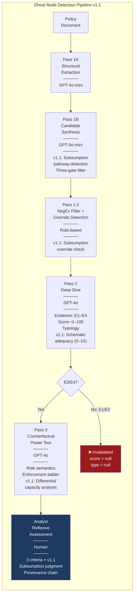
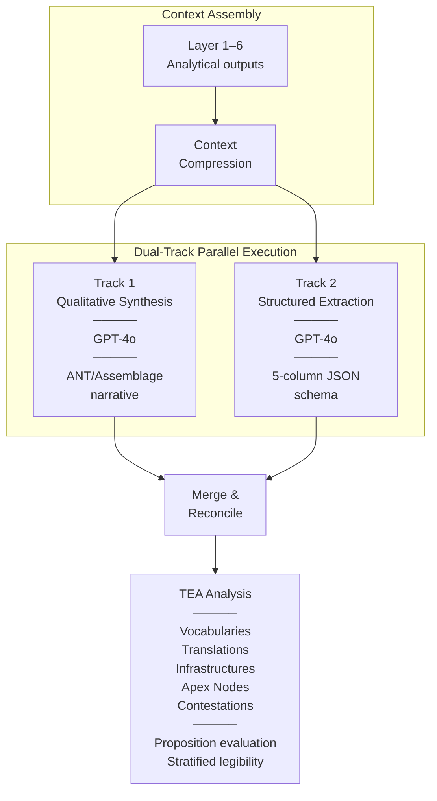

# Policy Prism — System Architecture Diagram

## High-Level Architecture

```mermaid
graph TB
    subgraph User["👤 Researcher"]
        Upload["Upload PDF / URL"]
        Review["Analyst Assessment"]
        Export["Export DOCX / JSON / CSV"]
    end

    subgraph UI["Presentation Layer — Next.js 16 App Router"]
        DataPage["/data"]
        EcoPage["/ecosystem"]
        OntPage["/ontology"]
        CompPage["/comparison"]
        TeaPage["/tea-analysis"]
        SettingsPage["/settings/prompts"]
    end

    subgraph API["API Layer — Route Handlers"]
        AnalyzeAPI["/api/analyze"]
        GhostAPI["/api/ghost-nodes"]
        CollabAPI["/api/collaboration"]
        CreditsAPI["/api/credits"]
    end

    subgraph Services["Service Layer"]
        ContentExtractor["Content Extractor"]
        AnalysisService["Analysis Service"]
        PromptRegistry["Prompt Registry\n36 versioned prompts"]
        GhostNodeService["Ghost Node Service\n11 modules"]
        ComparativeService["Comparative Synthesis"]
        TLFService["TLF Meta-Synthesis"]
    end

    subgraph Framework["Eight-Layer Analytical Framework"]
        L1["Layer 1\nRelationship Extraction\nANT Tracing · Assemblage"]
        L2["Layer 2\nEcosystem Mapping\nForce-directed graph"]
        L3["Layer 3\nGhost Node Detection\nGNDP v1.1"]
        L4["Layer 4\nOntology Generation\nConcept mapping"]
        L5["Layer 5\nCultural Framing\nLogics · Legitimacy · DSF"]
        L6["Layer 6\nResistance Analysis\nCounter-conduct"]
        L7["Layer 7\nComparative Synthesis\nCross-document divergence"]
        L8["Layer 8\nMeta-Synthesis\nTLF · Controversy · Abstract Machine"]
    end

    subgraph External["External Services"]
        GPT4o["GPT-4o\nAnalysis · GNDP Pass 2/3 · TLF"]
        GPT4oMini["GPT-4o-mini\nParsing · GNDP Pass 1A/1B"]
        Gemini["Gemini 1.5 Flash\nWeb search processing"]
        Clerk["Clerk Auth"]
        Stripe["Stripe Payments"]
        Google["Google Custom Search"]
    end

    subgraph Data["Data Layer"]
        Redis[("Redis / Upstash\n86,400s TTL cache")]
    end

    Upload --> DataPage
    Review --> GhostAPI
    Export --> DataPage

    DataPage --> AnalyzeAPI
    EcoPage --> AnalyzeAPI
    OntPage --> AnalyzeAPI
    CompPage --> AnalyzeAPI
    TeaPage --> AnalyzeAPI
    DataPage --> GhostAPI
    SettingsPage --> PromptRegistry

    AnalyzeAPI --> AnalysisService
    AnalyzeAPI --> ContentExtractor
    GhostAPI --> GhostNodeService
    CreditsAPI --> Stripe

    AnalysisService --> PromptRegistry
    GhostNodeService --> L3
    ComparativeService --> L7
    TLFService --> L8

    L1 --> L2
    L1 & L2 & L3 & L4 & L5 & L6 --> L7
    L7 --> L8

    AnalysisService --> GPT4o
    AnalysisService --> GPT4oMini
    AnalysisService --> Gemini
    GhostNodeService --> GPT4o
    GhostNodeService --> GPT4oMini
    AnalysisService --> Google

    AnalyzeAPI --> Redis
    GhostAPI --> Redis
    AnalyzeAPI --> Clerk
```

## GNDP v1.1 Pipeline Detail

```mermaid
graph LR
    subgraph GNDP["Ghost Node Detection Pipeline v1.1"]
        PDF["Policy\nDocument"] --> P1A
        P1A["Pass 1A\nStructural\nExtraction\n─────\nGPT-4o-mini"] --> P1B["Pass 1B\nCandidate\nSynthesis\n─────\nGPT-4o-mini\n─────\nv1.1: Subsumption\npathway detection\nThree-gate filter"]
        P1B --> P15["Pass 1.5\nNegEx Filter +\nOverride Detection\n─────\nRule-based\n─────\nv1.1: Subsumption\noverride check"]
        P15 --> P2["Pass 2\nDeep Dive\n─────\nGPT-4o\n─────\nEvidence: E1–E4\nScore: 0–100\nTypology\nv1.1: Schematic\nadequacy (0–10)"]
        P2 --> Gate{"E3/E4?"}
        Gate -->|Yes| P3["Pass 3\nCounterfactual\nPower Test\n─────\nGPT-4o\n─────\nRole semantics\nEnforcement ladder\nv1.1: Differential\ncapacity analysis"]
        Gate -->|No: E1/E2| Invalid["❌ Invalidated\nscore = null\ntype = null"]
        P3 --> AR["Analyst\nReflexive\nAssessment\n─────\nHuman\n─────\n3 criteria + v1.1\nSubsumption judgment\nProvenance chain"]
    end

    style Invalid fill:#991b1b,color:#fff
    style AR fill:#1e3a5f,color:#fff
```

## TLF Dual-Track Architecture

```mermaid
graph TB
    subgraph Input["Context Assembly"]
        S1["Layer 1–6\nAnalytical outputs"] --> Compress["Context\nCompression"]
    end

    Compress --> Track1 & Track2

    subgraph Parallel["Dual-Track Parallel Execution"]
        Track1["Track 1\nQualitative Synthesis\n─────\nGPT-4o\n─────\nANT/Assemblage\nnarrative"]
        Track2["Track 2\nStructured Extraction\n─────\nGPT-4o\n─────\n5-column JSON\nschema"]
    end

    Track1 --> Merge["Merge &\nReconcile"]
    Track2 --> Merge

    Merge --> Output["TEA Analysis\n─────\nVocabularies\nTranslations\nInfrastructures\nApex Nodes\nContestations\n─────\nProposition evaluation\nStratified legibility"]
```
